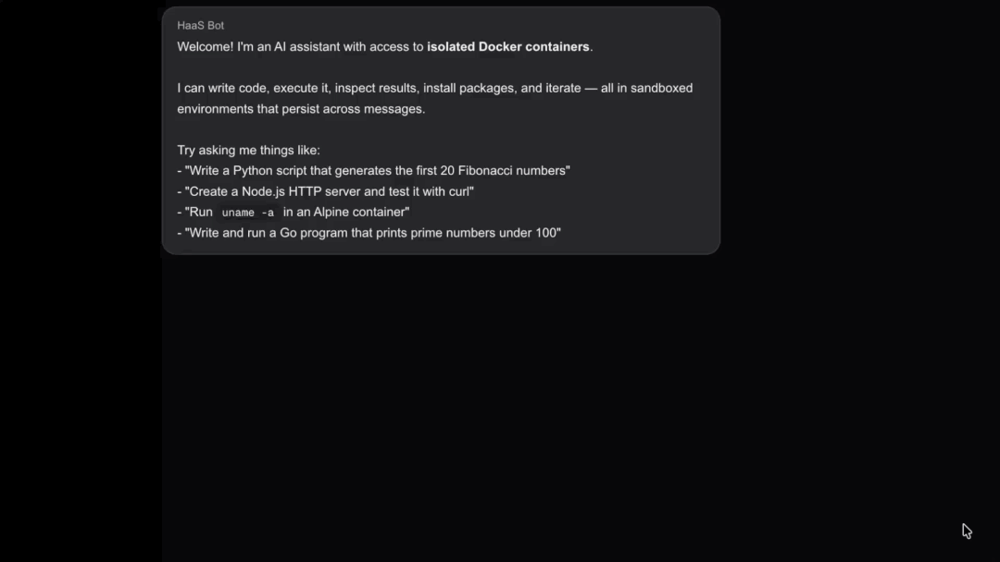

# HaaS Chat

An AI chat assistant that can write, execute, and iterate on code inside isolated Docker containers using [HaaS (Harness-as-a-Service)](https://github.com/dacs30/Forge-Agent-Harness-API).

Built with Next.js and OpenAI as the model provider.



## Features

- **Sandboxed code execution** — spins up ephemeral Docker containers (Python, Node, Go, Rust, Ruby, Alpine) on demand
- **Agentic tool loop** — the AI creates environments, writes files, runs commands, reads output, and iterates automatically
- **File downloads** — generates files (Excel, PDF, images, etc.) inside containers and offers them for download
- **Streaming UI** — real-time tool activity and responses streamed to the browser via NDJSON
- **Persistent environments** — containers stay alive across messages so users can continue working

## Getting Started

1. **Start the HaaS server** on `localhost:8080` (or set `HAAS_URL`)

2. **Configure environment variables** — create `.env.local`:
   ```
   OPENAI_API_KEY=sk-...
   HAAS_URL=http://localhost:8080   # optional, this is the default
   HAAS_API_KEY=your-haas-key       # optional, sent as Bearer token to HaaS
   OPENAI_MODEL=gpt-5.2             # optional, this is the default
   ```

3. **Install and run:**
   ```bash
   npm install
   npm run dev
   ```

4. Open [http://localhost:3000](http://localhost:3000)
